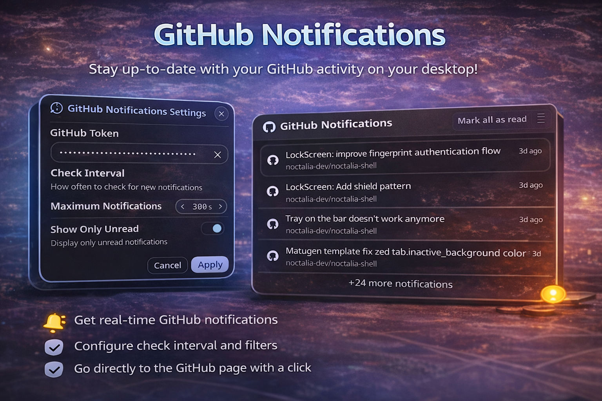

# GitHub Notifications Plugin

Monitor your GitHub notifications directly from Noctalia Shell. Get real-time updates, see unread counts, and manage notifications without opening your browser.

## Features

- **Real-time Updates**: Automatically checks for new notifications at configurable intervals
- **Unread Badge**: Shows the number of unread notifications on the bar widget
- **Detailed View**: Opens a panel with all your notifications including:
  - Issue notifications
  - Pull Request notifications
  - Release announcements
  - Check Suite results
  - Discussion updates
- **Mark as Read**: Mark individual notifications or all at once
- **Quick Actions**: Click to open notifications in browser
- **Filtering**: Option to show only unread notifications
- **Secure**: Uses GitHub Personal Access Token (never stores your password)
- **Multilingual**: Full internationalization support

## Setup Instructions

### Step 1: Create GitHub Personal Access Token

1. Go to [GitHub Settings → Developer Settings → Personal Access Tokens](https://github.com/settings/tokens)
2. Click **"Generate new token"** → **"Generate new token (classic)"**
3. Configure the token:
   - **Note**: `Noctalia Notifications` (or any name you prefer)
   - **Expiration**: Choose your preference (30 days, 90 days, no expiration, etc.)
   - **Select scopes**:
     - ✅ **notifications** (required - read and mark notifications)
4. Click **"Generate token"** at the bottom
5. **Important**: Copy the generated token (starts with `ghp_`) - you won't be able to see it again!

### Step 2: Configure the Plugin

1. Right-click the GitHub icon in your Noctalia bar
2. Select **"Settings"**
3. Paste your token in the **"GitHub Token"** field
4. Configure optional settings:
   - **Check Interval**: How often to check for notifications (default: 5 minutes)
   - **Show Only Unread**: Toggle to show only unread notifications
   - **Maximum Notifications**: Limit the number of notifications displayed (default: 30)
5. Click **"Save"**

## Usage

- **View Notifications**: Click the GitHub icon to open the notification panel
- **Mark as Read**: Click the check icon (✓) next to any notification
- **Mark All as Read**: Click the button in the panel header
- **Open in Browser**: Click on any notification to open it in your browser
- **Refresh**: Click the refresh button in the panel footer

## Configuration

| Setting              | Description                                    | Default     |
| -------------------- | ---------------------------------------------- | ----------- |
| `githubToken`      | Your GitHub Personal Access Token              | (required)  |
| `checkInterval`    | How often to check for notifications (seconds) | 300 (5 min) |
| `showOnlyUnread`   | Show only unread notifications                 | false       |
| `maxNotifications` | Maximum notifications to display               | 30          |

## Notification Types

The plugin supports all GitHub notification types:

- 🐛 **Issues**: Bug reports and feature requests
- 🔀 **Pull Requests**: Code reviews and merges
- 📦 **Releases**: New version announcements
- ✅ **Check Suites**: CI/CD pipeline results
- 💬 **Discussions**: Community discussions

## Troubleshooting

### Notifications not loading

- **Check your token**: Make sure the token is correct and has the `notifications` scope
- **Token expired**: GitHub tokens can expire - generate a new one if needed
- **API rate limit**: GitHub has rate limits - the plugin respects these automatically

### "Bad credentials" error

Your token is invalid or has been revoked. Generate a new token and update the plugin settings.

### Notifications not updating

- Check the **Check Interval** setting - lower values update more frequently
- Click the **Refresh** button in the panel to force an update
- Make sure you have an active internet connection

## Privacy

- Your GitHub token is stored locally and securely
- The plugin only communicates with GitHub's official API
- No data is sent to third parties
- You can revoke the token at any time in GitHub settings

## Permissions

The plugin requires the `notifications` scope which allows:

- **Read**: View your notifications
- **Write**: Mark notifications as read

The plugin **cannot**:

- Access your code or repositories
- Make commits or changes
- Access other users' data

## Contributing

Found a bug or have a feature request? Open an issue on the [Noctalia Plugins repository](https://github.com/noctalia/noctalia-plugins).

## License

MIT License - See repository for details

## Credits

- **Author**: Lokize
- **Repository**: https://github.com/noctalia-dev/noctalia-plugins
- **Noctalia Shell**: https://noctalia.dev

## Changelog

### Version 1.0.0 (2026-01-05)

**Initial Release**

Features:

- Real-time GitHub notifications monitoring via Personal Access Token
- Bar widget with GitHub icon and unread count badge
- Full notification panel with scrollable list
- Type-specific icons for Issues, Pull Requests, Releases, Check Suites, and Discussions
- Mark individual notifications as read by clicking on them
- Mark all notifications as read with single button
- Auto-open notifications in browser when clicked
- Configurable check interval (60-3600 seconds)
- Show only unread or all notifications option
- Maximum notifications limit (configurable)
- Comprehensive settings UI with 5-step setup help dialog
- Full internationalization support for 12 languages:
  - English, Portuguese, German, Spanish, French, Italian
  - Japanese, Dutch, Russian, Turkish, Ukrainian, Chinese (Simplified)
- Efficient data sharing between BarWidget and Panel to minimize API requests
- Timer-based automatic updates with configurable interval
- Visual differentiation for unread notifications (bold text, colored indicator)
- Complete error handling and user feedback
- Responsive design adapting to Noctalia Shell theme
- GitHub REST API v3 integration
- Compatible with Noctalia Shell 3.6.0+

### Technical:

- Built with Quickshell framework
- Declarative Process with StdioCollector for API calls
- Noctalia UI components (NButton, NLabel, NTextInput, etc.)
- Shared state management via pluginApi
- Automatic refresh on BarWidget trigger
- Clean architecture with separated concerns (BarWidget, Panel, Settings)
